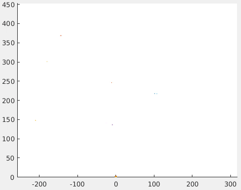
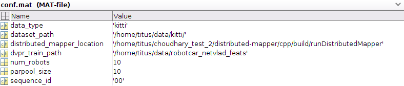
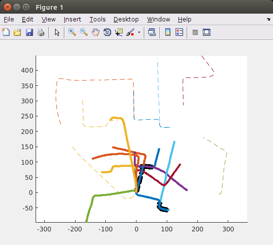

# Data-Efficient Decentralized Visual SLAM



This is the code for the 2018 ICRA paper **Data-Efficient Decentralized Visual SLAM** by [Titus Cieslewski](http://rpg.ifi.uzh.ch/people_titus.html), [Siddharth Choudhary](http://schoudhary.net/) and [Davide Scaramuzza](http://rpg.ifi.uzh.ch/people_scaramuzza.html):
```bibtex
@Article{Cieslewski18icra,
  author        = {Titus Cieslewski and Siddharth Choudhary and Davide
                  Scaramuzza},
  title         = {Data-Efficient Decentralized Visual {SLAM}},
  journal       = {{IEEE} Int. Conf. Robot. Autom. ({ICRA})},
  year          = 2018,
  month         = may
}
```
You can find a pdf of the paper [here](http://rpg.ifi.uzh.ch/docs/ICRA18_Cieslewski.pdf). If you use any of this code, please cite this publication.

## Downloads

| File     | Size | Description   | sha1 |
| -------- | -----| ------------- | ---- |
| [kitti.zip](http://rpg.ifi.uzh.ch/datasets/dslam/kitti.zip) | 144.7MB | Intermediate files for KITTI 00 | f5f39202afdb598d50dc14d43580114cd7eb81bf |
| [stata.zip](http://rpg.ifi.uzh.ch/datasets/dslam/stata.zip) | 649.8MB | Intermediate files for Stata 2012-01-25-12-14-25 | 8b6c488ce3ca99b7abd41a553387ef9c7c447a24 |
| [robotcar_netvlad_feats.zip](http://rpg.ifi.uzh.ch/datasets/dslam/robotcar_netvlad_feats.zip) | 414MB | NetVLAD features used for DVPR cluster training | 8785d63dd56b15ebc8de8a6b1c7e3554754953e4 |

## Install instructions

### C++

Install the [ROS ecosystem](http://wiki.ros.org/ROS/Installation). This has been developed with ROS version [Jade](http://wiki.ros.org/jade) under Ubuntu 14.04. Minimal installation will do. Next, install [catkin tools](http://catkin-tools.readthedocs.org/en/latest/installing.html), [vcstool](https://github.com/dirk-thomas/vcstool), OpenCV-nonfree dev, autoconf and libglew-dev:

    sudo add-apt-repository --yes ppa:xqms/opencv-nonfree # Maybe not necessary for Ubuntu > 14.04?
    sudo apt-get update
    sudo apt-get install python-catkin-tools python-vcstool libopencv-nonfree-dev autoconf libglew-dev

    # Create a new catkin workspace if needed:
    mkdir -p my_ws/src
    cd my_ws
    catkin config --init --mkdirs --extend /opt/ros/<YOUR VERSION> --merge-devel --cmake-args -DCMAKE_BUILD_TYPE=Release

    # Clone dslam:
    cd src
    git clone git@github.com:uzh-rpg/dslam_open.git
    
    # Clone dependencies:
    vcs-import < dslam_open/dependencies.yaml

    # Build:
    catkin build

### Matlab

For full reproduction, you need to install [NetVLAD](https://github.com/Relja/netvlad) and all its dependencies and add it to your matlab path. However, for the datasets evaluated in the paper, we provide the intermediate results generated by NetVLAD, so you can skip the installation of NetVLAD for now.

### Distributed Trajectory Estimation

Build [distributed-mapper](https://github.com/CognitiveRobotics/distributed-mapper) in the `feature/logging` branch in an arbitrary location. No need to build the unit tests (they require extra dependencies), all you need is the `runDistributedMapper` executable.

## Run instructions

In the following, we list all data processing steps that produce intermediate results. All intermediate results are saved in `<DATASET SEQUENCE ROOT>/dslam/`. Furthermore, we provide all intermediate results for the datasets evaluated in the paper, so you can skip the corresponding steps and just use our intermediate results. Note that some steps are nondeterministic (ORB SLAM, NetVLAD clustering, the decentralized SLAM simulation itself).

### Dataset preprocessing

Note that these are only necessary if you want to reproduce the pipeline fully or want to adapt the pipeline to your own dataset. If you just want to run the system on either of the two datasets in the paper, you can use the preprocessed data we provide and skip straight to `Execute the remaining preprocessing sections`.

#### KITTI 00

For KITTI 00, obtained [here](http://www.cvlibs.net/datasets/kitti/eval_odometry.php), no special preprocessing is necessary.

#### Stata 2012-01-25-12-14-25

For Stata 2012-01-25-12-14-25, which can be obtained [here](http://projects.csail.mit.edu/stata/downloads.php), we require somewhat more preprocessing. We need to first rectify the images and then parse images, times and ground truth poses out of the rosbag. Launch `dslam/launch/rectify_stata.launch`, start recording `/wide_stereo/left/image_rect` and `/wide_stereo/right/image_rect` into a rosbag, and play back the main dataset rosbag. Once the images are rectified, run `dslam/src/stata_unbag.py` with the following parameters:

* `--bag_name` path to the main bag downloaded from the dataset website
* `--rect_bag_name` path to the bag with rectified images you just created
* `--outdir` output directory
* `--tf_file` the ground truth `.poses` file downloaded from the stata dataset (rightmost column in the downloads table)

This will take some time and create the `images` folder in the output directory, as well as `times.txt`, `gt_poses.txt` and some auxiliary files that help you assemble the ORB SLAM settings file (or you can use the one we provide).

### Run ORB SLAM (loop closure disabled) to generate visual odometry data

In your catkin workspace, run dataset_to_vo, for example on KITTI 00:

    ./devel/lib/dslam/dataset_to_vo --type=kitti /home/titus/data/kitti/00/ /home/titus/data/kitti/00/orb_kitti.yaml

Where `orb_kitti.yaml` are the configuration parameters to run ORB SLAM on the KITTI datasets. They are available in the files we provide for download. Once this has completed, the following files will be created in the current working directory:

    descs_0.txt
    lm_obs_0.txt
    lm_pos_0.txt
    poses_0.txt
    times_0.txt
    
Copy these files to `<DATASET SEQUENCE ROOT>/dslam/`. If more than one set of these exists, ORB SLAM failed at some point. In that case, either rerun the simulation until it does not fail, or, if you have one set containing the majority of the dataset, just use that set (rename it to end with `_0.txt`).

### Configure the main simulation parameters in decentr_sim.m

All subsequent steps will take place in the Matlab script `dslam/matlab/decentr_sim.m`, so open that script in Matlab and set the configuration variables as indicated in the first section. Here is an example configuration:



Note that `dvpr_train_path` is the path containing NetVLAD features to be used for the clustering of the NetVLAD space used by decentralized visual place recognition. See the [corresponding paper](http://rpg.ifi.uzh.ch/docs/MRS17_Cieslewski.pdf) for detailed insight. As features, we used a random bunch of features extracted from several sequences of the [Oxford RobotCar](http://robotcar-dataset.robots.ox.ac.uk) dataset. These features are available as download and we recommend you use them as well. Alternatively, you can have the variable point to any folder containing several `.bin` files with NetVLAD output, representing your NetVLAD clustering training dataset.

### Parse NetVLAD descriptors for the dataset

This step takes quite some time (10 minutes on KITTI 00 with an NVIDIA GT 1060), so consider using the provided file instead. If you still want to run this yourself, in `decentr_sim.m`, execute the section `%% Generate NetVLAD vectors for dataset`. Note that this requires NetVLAD weights. We used `vd16_pitts30k_conv5_3_vlad_preL2_intra_white.mat` provided [here](http://www.di.ens.fr/willow/research/netvlad/). Once the parsing is complete, the file `netvlad_feats.bin` will appear in `<DATASET SEQUENCE ROOT>/dslam/`.

Note that NetVLAD can only take `jpg` pictures as input. You might need to convert any `png` pictures into `jpg`, for example using the following bash commands:
```bash
for i in *.png ; do convert "$i" "${i%.*}.jpg" ; done
```

### Execute the remaining preprocessing sections

The next three sections in `decentr_sim.m` take you through the rest of preprocessing that sets up the decentralized SLAM simulation:

1. `parseAllData()` zips up the visual odometry (VO) output from ORB SLAM and the NetVLAD descriptors parsed in the previous section and puts the result into `full_data.mat`.
2. `splitAndSave()` subdivides the VO + NetVLAD data into `n` subsequences, one per simulated robot. The result is saved in `full_data_n_robots.mat`, where `n` is replaced with the used number of robots.
3. `generateDecentrFrameStream()` takes the subsequences and rearranges the VO data into a stream representing the VO of all sequences being played back simultaneously. The stream is saved into `decentr_stream_n_robots.mat`.

### Simulate!

Now that all preprocessing is done, you are ready to run the decentralized SLAM simulation!

1. Tweak the parameters in the `%% Parameters` section.
2. Don't forget to have one process of the `verification_request_server` running.

If you are running inside the `dslam/matlab` directory, the `verification_request_server` can be run with:

     ../../../../devel/lib/dslam/verification_request_server temp_request.txt temp_result.txt temp_lock.txt

Execute up until and with the `runSimulationAndSave()` command. This command will run the simulation and give you live visual feedback like this (see also gif on top of readme):



Once the simulation is complete, results will be written into a file called `run_data_X.mat`, where `X` contains a string of the parameters used in the simulation.

### Plot

Once the simulation is complete, you can re-plot the paper figures for your run with the sections following `runSimulationAndSave()` in `decentr_sim.m`. If you want to reproduce the parameter studies (`min dist gv parameter study` and `NetVLAD dimension parameter study`), you can find the code for them in `param_studies.m`.

## Acknowledgements

This research was funded by the DARPA FLA Program, the National Center of Competence in Research (NCCR) Robotics through the Swiss National Science Foundation, the SNSF-ERC Starting Grant and the U.S. Army Research Lab (ARL) through the MAST-CTA project 329420
